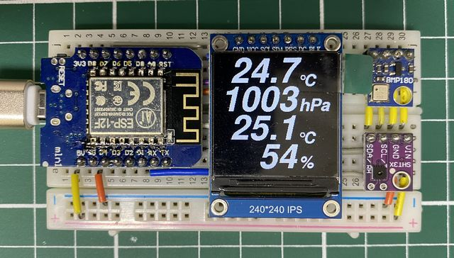
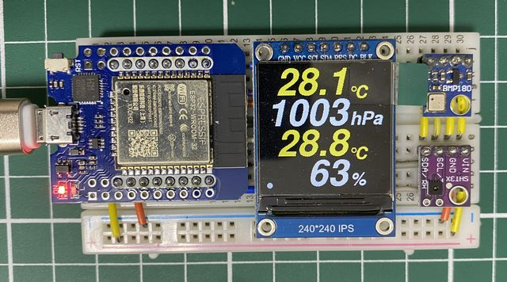
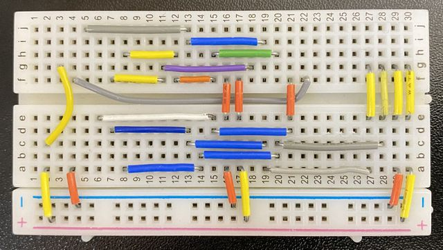

# ESP_ST7789_WeatherSensor

## 概要

温度・湿度・気圧センサーの値をディスプレイに表示する 
フォントは、https://github.com/cosmoois/u8g2_font_FreeSansBoldOblique で作成したものを使用しています 

## ハードウェア構成

・D1 mini(Ai-Thinker ESP-12F換装, 技適番号:210-133697) 
  または、D1 mini ESP32 
・1.3インチ240x240ディスプレイモジュール(ドライバIC:ST7789) 
・BMP180 
・SHT31 

## 配線

D1 miniとピン互換にするため、ESP32のピンをリマッピングしています。 

